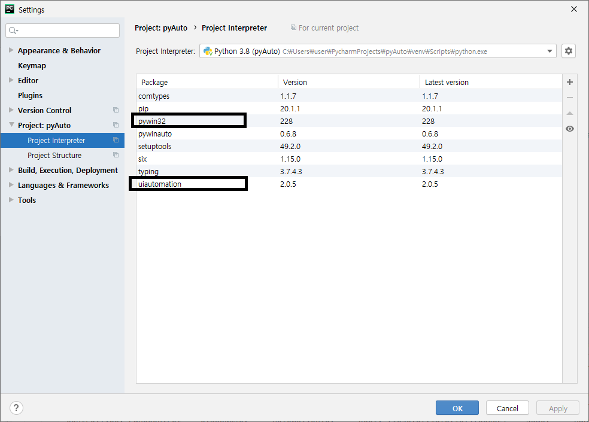
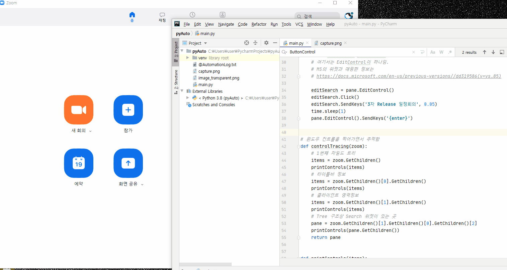

## Python 기반의 RPA(Remote Process Automation)

> 자동화 솔루션을 만들 때 Python의 레퍼런스가 제일 많다 . 그러나 대부분 Console 기반이었지만, GUI가 있는 프로그램의 경우도 종종 자동화 솔루션이 제공될 때가 있다. 이 때 사용하는 엔진이 Microsoft에서 제공하는 [UI Automation](https://docs.microsoft.com/ko-kr/dotnet/framework/ui-automation/ui-automation-overview)이다. 

그리고 이를 기반으로 Python에서 사용할 수 있도록 만든 오픈소스가 있다. 
https://github.com/yinkaisheng/Python-UIAutomation-for-Windows

개발환경

- python 3.8
- pycharm 
  - uiautomation
  - pywin32

~~~python
#!python3
# -*- coding: utf-8 -*-
import time
import ctypes
import uiautomation as auto
import subprocess

# uiautomation as auto는
# Microsoft의 UIAutomation을 python으로 래핑한 것임
# https://github.com/yinkaisheng/Python-UIAutomation-for-Windows
# 위의 주소에서 예제를 활용함.

# zoom이 실행된 상태에서 window에 등록된 클래스를 검색해서 처리한다.
def zoomSearch():
    zoom = auto.WindowControl(searchDepth=1, ClassName='ZPPTMainFrmWndClassEx')
    if not zoom.Exists(3, 1):
        print('Can not find Notepad window')
        exit(0)
    # print(zoom)
    selectByChildTree(zoom)

# window 구조를 보는 Inspector 프로그램의 결과로 child를 찾아가는 방식
# ClassName이 없을 경우, WindowsControle을 찾은 후
# ChildTree를 따라가는 방법이 제일확실함
def selectByChildTree(zoom):

    pane = controlTracing(zoom)

    # EditControl에서 parameter로 검색추출가능
    # 여기서는 EditControl이 하나임.
    # MS의 위젯과 매핑한 정보는
    # https://docs.microsoft.com/en-us/previous-versions//dd319586(v=vs.85)

    editSearch = pane.EditControl()
    editSearch.Click()
    editSearch.SendKeys('3차 Release 일정회의', 0.05)
    time.sleep(1)
    pane.EditControl().SendKeys('{enter}')

# 윈도우 컨트롤을 찍어가면서 추적함
def controlTracing(zoom):
    # 1번째 차일드 트리
    items = zoom.GetChildren()
    printControls(items)
    # 타이틀바 정보
    items = zoom.GetChildren()[0].GetChildren()
    printControls(items)
    # 클라이언트 영역정보
    items = zoom.GetChildren()[1].GetChildren()
    printControls(items)
    # Tree 구조상 Search 위젯이 있는 곳
    pane = zoom.GetChildren()[1].GetChildren()[0].GetChildren()[2]
    printControls(pane.GetChildren())
    return pane

def printControls(items):
    for i in items:
        print(i)

def CaculatorShow():
    subprocess.Popen('calc.exe')

    cal = auto.WindowControl(searchDepth=1, Name='계산기')
    if not cal.Exists(3, 1):
        print('Can not find Calculator window')
        exit(0)

    # inspertor로 검색된 ButtonControl의 name의 값을 넣어야 한다.
    cmd = ["2", "8", "0", "0", "0", "0","0", "0", "곱하기", "0", "소수 구분 기호", "3", "같음"]
    for c  in cmd:
        cal.ButtonControl(Name=c).Click()

# function table
pFunc = [zoomSearch, CaculatorShow ]

if __name__ == '__main__':
    uiLanguage = ctypes.windll.kernel32.GetUserDefaultUILanguage()

    for p in pFunc:
        p()
~~~

